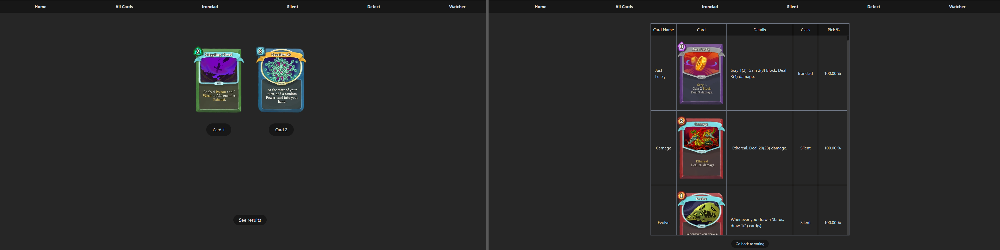

<!-- Improved compatibility of back to top link: See: https://github.com/othneildrew/Best-README-Template/pull/73 -->

<a name="readme-top"></a>

<!--
*** Thanks for checking out the Best-README-Template. If you have a suggestion
*** that would make this better, please fork the repo and create a pull request
*** or simply open an issue with the tag "enhancement".
*** Don't forget to give the project a star!
*** Thanks again! Now go create something AMAZING! :D
-->

<!-- PROJECT SHIELDS -->
<!--
*** I'm using markdown "reference style" links for readability.
*** Reference links are enclosed in brackets [ ] instead of parentheses ( ).
*** See the bottom of this document for the declaration of the reference variables
*** for contributors-url, forks-url, etc. This is an optional, concise syntax you may use.
*** https://www.markdownguide.org/basic-syntax/#reference-style-links
-->

[![Contributors][contributors-shield]][contributors-url]
[![Forks][forks-shield]][forks-url]
[![Stargazers][stars-shield]][stars-url]
[![Issues][issues-shield]][issues-url]
[![MIT License][license-shield]][license-url]
[![LinkedIn][linkedin-shield]][linkedin-url]

<!-- PROJECT LOGO -->
<br />
<div align="center">
  <a href="https://github.com/hberkaykuran/sts-tierlist">
    
  </a>

<h3 align="center">StS Tierlist</h3>

  <p align="center">
  
    Card tierlist of the popular rogue-like deck-building game Slay the Spire. Uses the <a href="https://github.com/hberkaykuran/sts-api">StS-API</a> I developed to get cards and results, and submit votes.
    <br />
    <a href="https://github.com/hberkaykuran/sts-tierlist"><strong>Explore the docs »</strong></a>
    <br />
    <br />
    <a href="https://github.com/hberkaykuran/sts-tierlist">View Demo</a>
    ·
    <a href="https://github.com/hberkaykuran/sts-tierlist/issues">Report Bug</a>
    ·
    <a href="https://github.com/hberkaykuran/sts-tierlist/issues">Request Feature</a>
  </p>
</div>

<!-- TABLE OF CONTENTS -->
<details>
  <summary>Table of Contents</summary>
  <ol>
    <li>
      <a href="#about-the-project">About The Project</a>
      <ul>
        <li><a href="#built-with">Built With</a></li>
      </ul>
    </li>
    <li>
      <a href="#getting-started">Getting Started</a>
      <ul>
        <li><a href="#prerequisites">Prerequisites</a></li>
        <li><a href="#installation">Installation</a></li>
      </ul>
    </li>
    <li><a href="#license">License</a></li>
    <li><a href="#contact">Contact</a></li>
  </ol>
</details>

<!-- ABOUT THE PROJECT -->

## About The Project

I developed the app mainly to get familiar with TypeScript and API development.

### Built With

- [![Next][next.js]][next-url]
- [![React][react.js]][react-url]
- [![TypeScript][typescript]][typescript-url]
- [![TailwindCSS][tailwindcss]][tailwindcss-url]
- [![Prisma][prisma]][prisma-url]
- [![PlanetScale][planetscale]][planetscale-url]

<p align="right">(<a href="#readme-top">back to top</a>)</p>

<!-- GETTING STARTED -->

## Getting Started

To get a local copy up and running follow these simple example steps.

### Installation

1. Clone the repo
   ```sh
   git clone https://github.com/hberkaykuran/sts-tierlist.git
   ```
2. Install packages
   ```sh
   yarn install
   ```
3. Execute run command and access the site http://localhost:3000
   ```sh
   yarn dev
   ```

<p align="right">(<a href="#readme-top">back to top</a>)</p>

<!-- USAGE EXAMPLES -->

<!-- LICENSE -->

## License

Distributed under the MIT License. See `LICENSE` for more information.

<p align="right">(<a href="#readme-top">back to top</a>)</p>

<!-- CONTACT -->

## Contact

H.Berkay Kuran - [@hberkaykuran](https://twitter.com/hberkaykuran) - berkaykuran54@gmail.com

Project Link: [https://github.com/hberkaykuran/sts-tierlist](https://github.com/hberkaykuran/sts-tierlist)

<p align="right">(<a href="#readme-top">back to top</a>)</p>

<!-- MARKDOWN LINKS & IMAGES -->
<!-- https://www.markdownguide.org/basic-syntax/#reference-style-links -->

[contributors-shield]: https://img.shields.io/github/contributors/hberkaykuran/sts-tierlist.svg?style=for-the-badge
[contributors-url]: https://github.com/hberkaykuran/sts-tierlist/graphs/contributors
[forks-shield]: https://img.shields.io/github/forks/hberkaykuran/sts-tierlist.svg?style=for-the-badge
[forks-url]: https://github.com/hberkaykuran/sts-tierlist/network/members
[stars-shield]: https://img.shields.io/github/stars/hberkaykuran/sts-tierlist.svg?style=for-the-badge
[stars-url]: https://github.com/hberkaykuran/sts-tierlist/stargazers
[issues-shield]: https://img.shields.io/github/issues/hberkaykuran/sts-tierlist.svg?style=for-the-badge
[issues-url]: https://github.com/hberkaykuran/sts-tierlist/issues
[license-shield]: https://img.shields.io/github/license/hberkaykuran/sts-tierlist.svg?style=for-the-badge
[license-url]: https://github.com/hberkaykuran/sts-tierlist/blob/master/LICENSE
[linkedin-shield]: https://img.shields.io/badge/-LinkedIn-black.svg?style=for-the-badge&logo=linkedin&colorB=555
[linkedin-url]: https://linkedin.com/in/hberkaykuran
[product-screenshot]: images/screenshot.png
[next.js]: https://img.shields.io/badge/next.js-000000?style=for-the-badge&logo=nextdotjs&logoColor=white
[next-url]: https://nextjs.org/
[react.js]: https://img.shields.io/badge/React-20232A?style=for-the-badge&logo=react&logoColor=61DAFB
[react-url]: https://reactjs.org/
[prisma]: https://img.shields.io/badge/Prisma-3982CE?style=for-the-badge&logo=Prisma&logoColor=white
[prisma-url]: https://www.prisma.io/
[planetscale]: https://img.shields.io/badge/PlanetScale-white?style=for-the-badge&logo=data:image/svg+xml;base64,PD94bWwgdmVyc2lvbj0iMS4wIiBlbmNvZGluZz0iVVRGLTgiPz4KPHN2ZyB3aWR0aD0iMjU2cHgiIGhlaWdodD0iMjU2cHgiIHZpZXdCb3g9IjAgMCAyNTYgMjU2IiB2ZXJzaW9uPSIxLjEiIHhtbG5zPSJodHRwOi8vd3d3LnczLm9yZy8yMDAwL3N2ZyIgcHJlc2VydmVBc3BlY3RSYXRpbz0ieE1pZFlNaWQiPgogICAgPHRpdGxlPlBsYW5ldFNjYWxlPC90aXRsZT4KICAgIDxnPgogICAgICAgIDxwYXRoIGQ9Ik0yNTYsMTI4LjA0NDIxOCBDMjU1Ljk3NjE0NSwxOTguNzAxMzgyIDE5OC43MDEzODIsMjU1Ljk3NjE0NSAxMjguMDQ0MjE4LDI1NiBMMTI4LjA0NDIxOCwyNTYgWiBNMTI4LDAgQzE3OS45NzczMDksMCAyMjQuNzE4NTQ1LDMwLjk4MDY1NDUgMjQ0Ljc2NTA5MSw3NS40ODMzNDU1IEw3NS40ODMzNDU1LDI0NC43NjUwOTEgQzY4LjIxOTM0NTUsMjQxLjQ5Mjk0NSA2MS4zMTQ5MDkxLDIzNy41NjI3NjQgNTQuODQ3MzYsMjMzLjA1MDE4MiBMMTU5Ljg5NzYsMTI4IEwxMjgsMTI4IEwzNy40OTAzODU1LDIxOC41MDkzODIgQzE0LjMyNjkyMzYsMTk1LjM0NjAzNiAwLDE2My4zNDYwMzYgMCwxMjggQzAsNTcuMzA3NTIgNTcuMzA3NTc4MiwwIDEyOCwwIFoiIGZpbGw9IiMwMDAwMDAiPjwvcGF0aD4KICAgIDwvZz4KPC9zdmc+Cg==
[planetscale-url]: https://planetscale.com/
[typescript]: https://img.shields.io/badge/typescript-%23007ACC.svg?style=for-the-badge&logo=typescript&logoColor=white
[typescript-url]: https://www.typescriptlang.org/
[tailwindcss]: https://img.shields.io/badge/tailwindcss-%2338B2AC.svg?style=for-the-badge&logo=tailwind-css&logoColor=white
[tailwindcss-url]: https://tailwindcss.com/
